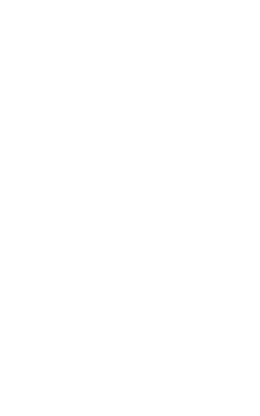

  <h1>Christer Warén</h1>
  <a href="https://christerwaren.fi">https://christerwaren.fi</a>

 

  <h3>Contact Me</h3>
  <a href="tel:+358 45 842 0860">+358 45 842 0860</a> 
  cwchristerw@gmail.com

 

  <h3>Social Media</h3>
  
  <a href="https://instagram.com/cwchristerw">Instagram</a> /
  
  <a href="https://www.linkedin.com/in/cwchristerw">LinkedIn</a> /
  
  <a href="https://youtube.com/@cwchristerw-">Youtube</a>

 

  <h3>Translations</h3>
  🇷🇺 Кристэр Варэн / 🇯🇵 クリステル・ワレン

 

  <h3>SSH Keys</h3>
  🌐 <a href="https://git.waren.io/cwchristerw/.profile/blob/master/docs/ssh-keys.md#public">Public</a>

 

  <h3>Crypto Wallets</h3>
  
  <a href="https://git.waren.io/cwchristerw/.profile/blob/master/docs/crypto-wallets.md#bitcoin">Bitcoin - BTC</a> /
  
  <a href="https://git.waren.io/cwchristerw/.profile/blob/master/docs/crypto-wallets.md#ethereum">Ethereum - ETH</a> /
  
  <a href="https://git.waren.io/cwchristerw/.profile/blob/master/docs/crypto-wallets.md#litecoin">Litecoin - LTC</a> /
  
  <a href="https://git.waren.io/cwchristerw/.profile/blob/master/docs/crypto-wallets.md#monero">Monero - XMR</a>

 

  <h3>Promolinks</h3>
  
  <strong>DigitalOcean</strong> 
  Receive $200 in cloud credit to test their products for 60 days. 
  <a href="https://m.do.co/c/4248d53011c8">Register Now</a>  

  
  <strong>Dynadot</strong> 
  Receive 4,5€ in account credit. 
  <a href="https://dynadot.com?sM7K8u7m6Z7pBo">Register Now</a>  

  
  <strong>Hetzner Cloud</strong> 
  Receive 20€ in cloud credits. 
  <a href="https://hetzner.cloud/?ref=w2QMbx2s3c3h">Register Now</a>  

  
  <strong>Ukko.fi</strong> 
  After you have invoiced €300 (excluding VAT) and received payment, 
  you can invoice €750 without a service fee. 
  <a href="https://app.ukko.fi/register?code=28419">Register Now</a>

 

  <h3>More repos available in</h3>
  
  <a href="https://github.com/cwchristerw">Github</a> /
  
  <a href="https://gitlab.com/cwchristerw">Gitlab</a> /
  <a href="https://git.waren.io/cwchristerw">Warén Git</a>

